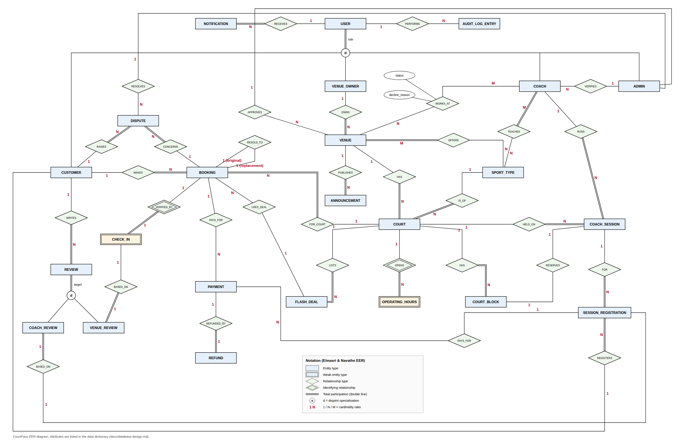
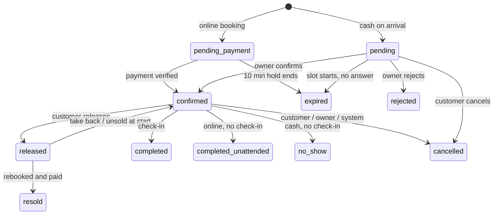
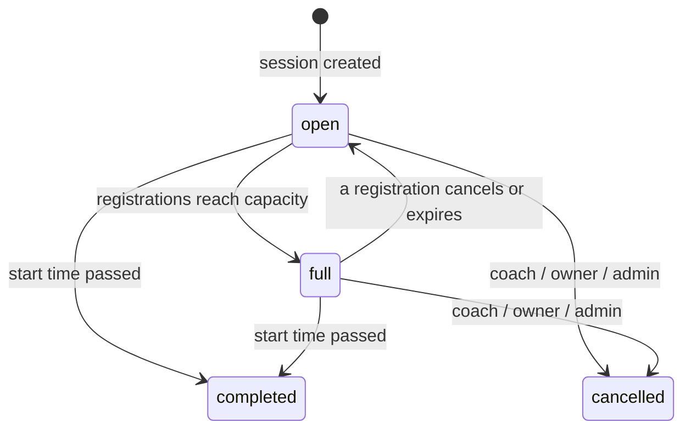
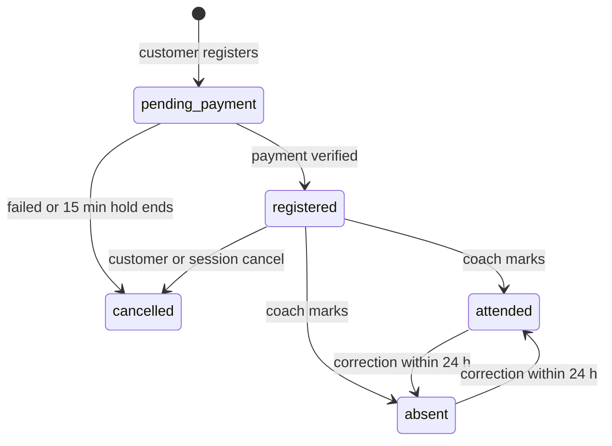

# CourtPass Database Design and Justification

Group 40 · 22 September 2026

## 1. Purpose and conventions

The CourtPass database has 23 tables that cover every in-scope feature of the Revised Project Proposal, including the Coach Module. This document explains what each table is for, why it is shaped the way it is, and which rules the database enforces on its own. It is the reference for `database/schema.sql` and `database/seed.sql` in the repo.

**Sources followed:** the Revised Project Proposal (overrides the original PDF and the old Coach Module Design PDF), the Coach Module Developer Guide (section 2 data model), and the team's build rules. The old prototype schema in `legacy/schema/` was used only as a reference for what to fix.

| Convention | What we use | Why |
| --- | --- | --- |
| DBMS | MariaDB 10.4+ (XAMPP) and MySQL 8.0+ | Same file must load on every member's machine |
| Engine | InnoDB on every table | Foreign keys, transactions and `SELECT ... FOR UPDATE` |
| Charset | `utf8mb4` + `utf8mb4_unicode_ci` | Sinhala and Tamil names; `utf8mb4_0900_*` does not exist in MariaDB |
| Table names | plural `snake_case` (`bookings`, `court_blocks`) | Matches one model per table in the MVC layer |
| Keys | surrogate `id INT UNSIGNED AUTO_INCREMENT`, except pure link tables and 1:1 subclass tables | Stable keys for URLs and foreign keys |
| Money | `DECIMAL(10,2)`, LKR | No floating point rounding on refunds |
| Time | `DATETIME` in Asia/Colombo, connection set to `+05:30` | Proposal fixes all times to Asia/Colombo; `DATETIME` does not shift if the server zone changes |
| Slot times | `DATE` + `TIME` on the hour | Fixed one-hour slots |
| Status fields | `ENUM` with locked values (section 6) | Proposal asks for locked enums shared by all members |
| Deletes | Accounts, venues, courts and bookings are never deleted, only deactivated or cancelled | History, audit log and refunds must keep pointing at real rows |

The schema was loaded and tested on MariaDB 10.11 with 38 constraint tests (section 7). It only uses features that MariaDB 10.4 and MySQL 8.0 both support: CHECK constraints, STORED generated columns and triggers. It was not run on a MySQL 8 server here, so one member should load it once on MySQL 8 as a check.

## 2. Issues found and how they were resolved

Before designing the schema we checked the proposal, the Developer Guide and the old prototype schema against each other. Nineteen gaps affected the database. Member A decided four of them (one also needs a proposal update), and the other fifteen were settled in the design, with the reasoning in section 5.

**Decided by the team (Member A, 22 Sep 2026)**

| # | Issue | Decision |
| --- | --- | --- |
| D1 | The proposal's five booking states do not cover owner reject, release for resale, resold, completed-unattended or waiting for payment | One `status` column with 11 locked values (section 6), no extra flag columns |
| D2 | The proposal says an unsold, unattended released booking has no reliability impact "because it was paid online", but does not say if this covers every online-paid no-show | Only cash-on-arrival no-shows affect reliability. Every online-paid no-show becomes `completed_unattended` |
| D3 | How long a court slot is held while the customer pays online | 10 minutes (`pending_expires_at`). Coaching registrations keep the 15 minutes the proposal already sets |
| D4 | Which bookings confirm automatically | See P1 below |

**Marked for a proposal update**

| # | Issue | What the proposal says now | What needs adding |
| --- | --- | --- | --- |
| P1 | Auto-confirmation rule | Only "Owners confirm, reject, or cancel bookings" (UC-VO-06) and "verify payment before confirming the related booking". No auto-confirm rule is written anywhere | The rule for which bookings skip owner confirmation. One option to discuss: online bookings confirm once PayHere verifies payment, and cash-on-arrival bookings wait for the owner. The schema supports any rule, because it only changes which status the service writes |

**Settled in the design (details in section 5)**

| # | Issue | Resolution |
| --- | --- | --- |
| S1 | Old key `UNIQUE(court, date, start, status)` still allowed two live bookings with different statuses on one slot | Generated `slot_lock` column + unique key |
| S2 | Should slots be stored as rows? | No, calculated from operating hours |
| S3 | Operating hours format not defined | One range per court per day, whole hours, close time exclusive, ISO day numbers |
| S4 | Sport types were a hard-coded ENUM on courts only | `sport_types` lookup + `venue_sports` + `coach_sports` |
| S5 | Old `resale_listings` table no longer fits the no-marketplace resale | Removed. Resale tracked on the booking itself |
| S6 | Refunds were a single column on payments | Separate `refunds` ledger, one refund per payment |
| S7 | Check-in (UC-VO-24) had no storage | `check_ins` table (weak entity of booking) |
| S8 | Two review tables with a Parent/Player tag the proposal dropped | One `reviews` table, no tags, neutral `response_text` |
| S9 | Roles only checked in PHP | Customer and coach subclass tables with a DB-enforced role |
| S10 | No-show and resale disputes had no table | One `disputes` table with a type, text-only evidence |
| S11 | Old schema stored an NIC photo path | Removed. `is_verified` flag only |
| S12 | Reliability formula is not defined in any document | Schema stores raw counts + cached score. Formula stays open for Member A's reliability work |
| S13 | "Immutable audit log" was only a comment | Triggers block UPDATE and DELETE |
| S14 | Legacy seed comments list passwords (admin123 etc.) that do not match the hashes (they all hash to "password") | New seed with real hashes for the passwords listed in `seed.sql` |
| S15 | Cash bookings still pending when the slot starts (owner never answered) | Become `expired`, no reliability impact |

**Still open (not blocking the schema)**

- Reliability score formula and the exact penalty per no-show or irresponsible cancellation (Member A).
- The auto-confirmation rule for the proposal (P1).
- Loading the schema once on a real MySQL 8 server.

## 3. EER diagram

The conceptual model has 24 entity types (2 weak, 6 subclasses), 2 specialisations and 33 relationship types. It uses Elmasri and Navathe EER notation. An editable copy is at `docs/diagrams/courtpass-eer.drawio` (open it in draw.io) next to the PNG.

**How to read it**

- Rectangles are entity types. Double rectangles are weak entities (`CHECK_IN`, `OPERATING_HOURS`), and double diamonds are the relationships that identify them.
- A double line means total participation. For example, every `BOOKING` must be made by a customer and be for a court, but a customer does not have to have any bookings.
- The circle with `d` is a disjoint specialisation. The double line from `USER` means it is total too: every user is exactly one of Customer, Venue Owner, Coach or Admin, decided by the `role` attribute. `REVIEW` is split the same way into `VENUE_REVIEW` and `COACH_REVIEW` by its target.
- Attributes are left off to keep 24 entities readable. The only exception is `WORKS_AT` (coach at venue), which is an M:N relationship with its own attributes, so two of them are drawn. Section 4 lists every attribute.

**Main relationships**

| Relationship | Between | Ratio | Participation |
| --- | --- | --- | --- |
| OWNS | Venue Owner, Venue | 1:N | every venue has an owner |
| APPROVES | Admin, Venue | 1:N | optional (pending venues) |
| HAS | Venue, Court | 1:N | every court belongs to a venue |
| OFFERS | Venue, Sport Type | M:N | every venue offers at least one sport |
| IS\_OF | Court, Sport Type | N:1 | every court has one sport |
| OPENS (identifying) | Court, Operating Hours | 1:N | hours exist only for a court |
| HAS | Court, Court Block | 1:N | every block is on a court |
| LISTS | Court, Flash Deal | 1:N | every deal is on a court |
| MAKES | Customer, Booking | 1:N | every booking has a customer |
| FOR\_COURT | Booking, Court | N:1 | every booking is for a court |
| USES\_DEAL | Booking, Flash Deal | N:1 | optional |
| RESOLD\_TO (recursive) | Booking, Booking | 1:1 | optional, only for resold bookings |
| VERIFIED\_BY (identifying) | Booking, Check-in | 1:1 | a check-in exists only for a booking |
| PAYS\_FOR | Payment, Booking / Registration | N:1 | each payment is for exactly one of the two |
| REFUNDED\_BY | Payment, Refund | 1:1 | a payment is refunded at most once |
| RAISES / CONCERNS | Customer, Dispute, Booking | 1:N / N:1 | every dispute has both |
| RESOLVES | Admin, Dispute | 1:N | optional until resolved |
| WORKS\_AT | Coach, Venue | M:N | attributes: status, decline reason, dates |
| TEACHES | Coach, Sport Type | M:N | every coach teaches at least one sport |
| VERIFIES | Admin, Coach | 1:N | optional |
| RUNS | Coach, Coach Session | 1:N | every session has a coach |
| HELD\_ON | Coach Session, Court | N:1 | every session is on a court |
| RESERVES | Coach Session, Court Block | 1:1 | a live session holds one block |
| REGISTERS / FOR | Customer, Registration, Coach Session | 1:N / N:1 | every registration has both |
| WRITES | Customer, Review | 1:N | every review has a writer |
| BASED\_ON | Venue Review, Check-in | 1:1 | a venue review needs a check-in |
| BASED\_ON | Coach Review, Registration | 1:1 | a coach review needs an attended registration |
| PUBLISHES | Venue, Announcement | 1:N | every announcement is for a venue |
| RECEIVES | User, Notification | 1:N | every notification has a user |
| PERFORMS | User, Audit Log Entry | 1:N | optional (system actions have no user) |

`SESSION_REGISTRATION` is drawn as an entity, not an M:N relationship between Customer and Coach Session. It has its own lifecycle, payments point to it and reviews are based on it, so it needs its own identity.

## 4. Data dictionary

Every table below is in `database/schema.sql` in this order. PK = primary key, FK = foreign key, UQ = unique, CK = check constraint, GEN = generated column. `created_at` / `updated_at` are on most tables and are not repeated.

### 4.1 Accounts

**users** (all accounts, superclass `USER`)

| Column | Type | Rules | Meaning |
| --- | --- | --- | --- |
| id | INT UNSIGNED | PK | Account id |
| role | ENUM customer, owner, coach, admin | UQ with id | One role per account, never changes |
| name, phone | VARCHAR |  | Contact details from sign-up |
| email | VARCHAR(191) | UQ | Unique across all roles. 191 chars keeps the index inside InnoDB limits on older setups |
| password\_hash | VARCHAR(255) |  | `password_hash()` output, room for future algorithms |
| status | ENUM active, deactivated | CK with deactivated\_at | Admin deactivation (UC-PA-06) |
| deactivated\_at, deactivated\_by | DATETIME, FK users |  | Who deactivated and when |

**customer\_profiles** (subclass `CUSTOMER`, 1:1)

| Column | Type | Rules | Meaning |
| --- | --- | --- | --- |
| customer\_id | INT UNSIGNED | PK, FK (customer\_id, role) to users (id, role) | Same id as the user |
| role | ENUM | CK = 'customer' | Makes the FK only match customer accounts |
| reliability\_score | DECIMAL(5,2) | CK 0 to 100, NULL | Cached score, NULL while New Member |
| reliability\_tier | ENUM new\_member, restricted, standard |  | Cached tier used for cash-on-arrival eligibility |
| completed\_count, no\_show\_count, responsible / moderate / irresponsible\_cancel\_count | INT UNSIGNED |  | Cached counts for the profile and customer intelligence |
| score\_calculated\_at | DATETIME |  | When the trigger-on-action recalculation last ran |

**coach\_profiles** (subclass `COACH`, 1:1)

| Column | Type | Rules | Meaning |
| --- | --- | --- | --- |
| coach\_id | INT UNSIGNED | PK, FK (coach\_id, role) to users (id, role) | Same id as the user |
| role | ENUM | CK = 'coach' | Only coach accounts can have this row |
| bio, certifications | TEXT |  | Text only, no files |
| experience\_level | ENUM beginner, intermediate, advanced, professional |  | Shown on the public profile |
| is\_verified, verified\_at, verified\_by | TINYINT, DATETIME, FK users | CK all set together | Admin Verified badge (UC-PA-11), no ID data |

**sport\_types** (id, code UQ, name): the seven sports from the proposal. **coach\_sports** (coach\_id, sport\_type\_id) PK on both: sports a coach teaches.

### 4.2 Venues and courts

**venues**

| Column | Type | Rules | Meaning |
| --- | --- | --- | --- |
| id | INT UNSIGNED | PK |  |
| owner\_id | FK users |  | Owning venue owner |
| name, description, address, city, contact\_phone | VARCHAR / TEXT |  | Registration details (UC-VO-01) |
| slug | VARCHAR(160) | UQ, CK lowercase-hyphen format | Public URL, e.g. `/venue/colombo-sports-hub` |
| status | ENUM pending, approved, rejected, deactivated | CK reason when rejected / deactivated | Admin lifecycle |
| rejection\_reason, deactivation\_reason | VARCHAR(500) |  | Mandatory reasons |
| reviewed\_by, reviewed\_at | FK users, DATETIME |  | Admin who approved or rejected |
| is\_active | TINYINT(1) |  | Owner's temporary deactivation switch |

**venue\_sports** (venue\_id, sport\_type\_id) PK on both: sports entered at registration.

**courts**: id PK, venue\_id FK, name (UQ per venue), sport\_type\_id FK, hourly\_rate DECIMAL CK > 0, is\_active.

**court\_operating\_hours** (weak): court\_id + day\_of\_week PK, day\_of\_week CK 1 to 7 (1 = Monday), open\_time and close\_time TIME, CK whole hours and close > open, close up to 24:00.

**court\_blocks**

| Column | Type | Rules | Meaning |
| --- | --- | --- | --- |
| id | INT UNSIGNED | PK |  |
| court\_id, block\_date, start\_time | FK, DATE, TIME | UQ together, CK on the hour | One block per slot |
| block\_type | ENUM owner, coaching |  | Coaching blocks can only be removed by cancelling the session |
| reason, created\_by | VARCHAR, FK users |  | Walk-in or event note, who blocked it |

**flash\_slots**: id PK, court\_id + slot\_date + start\_time UQ, original\_price, discounted\_price (CK 0 < discounted < original), status ENUM active, booked, expired, withdrawn, created\_by FK users.

### 4.3 Bookings

**bookings**

| Column | Type | Rules | Meaning |
| --- | --- | --- | --- |
| id | INT UNSIGNED | PK |  |
| customer\_id | FK customer\_profiles |  | Only customers can book |
| court\_id, slot\_date, start\_time | FK, DATE, TIME | CK on the hour | The one-hour slot |
| amount | DECIMAL(10,2) | CK > 0 | Price at booking time (court rate or flash price) |
| flash\_slot\_id | FK flash\_slots, NULL |  | Set when booked through a flash deal |
| payment\_method | ENUM online, cash\_on\_arrival |  | Changes to online after a conversion (UC-CU-31) |
| status | ENUM, 11 values | several CKs | See section 6 |
| slot\_lock | GEN TINYINT | UQ with court, date, time | 1 while the booking holds the slot, else NULL |
| pending\_expires\_at | DATETIME | CK set when pending\_payment | End of the 10 minute hold |
| confirmed\_at, released\_at | DATETIME |  | Timeline for the owner view and refund tiers |
| resold\_to\_booking\_id | FK bookings | UQ, CK set only when resold | The booking that took the released slot |
| cancelled\_by, cancelled\_at, cancel\_reason | FK users, DATETIME, VARCHAR | CK cancelled\_at when cancelled | Who cancelled and why |
| cancellation\_class | ENUM responsible, moderate, irresponsible | CK only on cancelled cash bookings | Feeds reliability |
| rejection\_reason | VARCHAR(500) | CK when rejected | Mandatory owner reason |

**check\_ins** (weak, 1:1 with bookings): booking\_id PK and FK, checked\_in\_by FK users (the owner), checked\_in\_at.

**disputes**: id PK, dispute\_type ENUM no\_show, resale, booking\_id FK, raised\_by FK customer\_profiles, reason TEXT, status ENUM open, upheld, dismissed, open\_lock GEN + UQ (one open dispute per booking and type), resolution\_note, resolved\_by FK users, resolved\_at (CK set when not open).

### 4.4 Coach Module

**coach\_venue\_approvals** (the `WORKS_AT` relationship): id PK, coach\_id FK coach\_profiles + venue\_id FK UQ together, status ENUM pending, approved, declined, revoked, decline\_reason (CK when declined), requested\_at, decided\_by FK users, decided\_at (CK when not pending).

**coach\_sessions**

| Column | Type | Rules | Meaning |
| --- | --- | --- | --- |
| id | INT UNSIGNED | PK |  |
| coach\_id | FK coach\_profiles |  | Session owner |
| court\_id, session\_date, start\_time | FK, DATE, TIME | CK on the hour | Slot the session uses |
| block\_id | FK court\_blocks, NULL | UQ, CK set unless cancelled | The coaching block reserving the slot |
| title, description | VARCHAR(100), TEXT |  | Listing text |
| capacity | SMALLINT UNSIGNED | CK >= 1 | Max participants |
| fee | DECIMAL(10,2) | CK >= 0 | Fee per participant |
| visibility | ENUM public, private |  | Private sessions are not listed |
| access\_token | CHAR(32) | UQ, CK set only for private, 32 hex chars | Private link token |
| status | ENUM open, full, completed, cancelled |  | See section 6 |
| cancelled\_by, cancel\_reason, cancelled\_at | FK users, VARCHAR, DATETIME | CK block released when cancelled | Coach, owner or admin cancel |

**session\_registrations**

| Column | Type | Rules | Meaning |
| --- | --- | --- | --- |
| id | INT UNSIGNED | PK | Used in the PayHere order id `REG-{id}` |
| session\_id | FK coach\_sessions |  |  |
| customer\_id | FK customer\_profiles |  | Coaches cannot register |
| status | ENUM pending\_payment, registered, attended, absent, cancelled |  | See section 6 |
| active\_lock | GEN TINYINT | UQ with session and customer | One live registration per customer per session |
| amount | DECIMAL(10,2) | CK >= 0 | Fee copied at registration time |
| pending\_expires\_at | DATETIME | CK set when pending\_payment | End of the 15 minute hold |
| cancel\_source, cancelled\_at | ENUM customer, session\_cancelled, payment\_failed, payment\_expired | CK both set only when cancelled | Why it was cancelled |
| attendance\_marked\_at | DATETIME | CK set when attended / absent | Starts the 24 hour correction window check |

### 4.5 Payments and refunds

**payments**

| Column | Type | Rules | Meaning |
| --- | --- | --- | --- |
| id | INT UNSIGNED | PK |  |
| purpose | ENUM booking, conversion, registration | CK matches the target | What was paid for |
| booking\_id, registration\_id | FK, NULL | CK exactly one set | The paid item |
| order\_id | VARCHAR(50) | UQ | Order id sent to PayHere, e.g. `BKG-15`, `CNV-15`, `REG-7` |
| amount, currency | DECIMAL(10,2), CHAR(3) | CK amount > 0 | LKR |
| status | ENUM pending, paid, failed, cancelled | CK paid\_at and PayHere id when paid | Result of the notify callback |
| payhere\_payment\_id | VARCHAR(50) | UQ | Stops a repeated callback being stored twice |
| payhere\_status\_code, payhere\_method, raw\_notify | SMALLINT, VARCHAR, TEXT |  | Kept for debugging the sandbox |

**refunds**: id PK, payment\_id FK **UQ**, reason ENUM (customer\_cancel, owner\_cancel, owner\_reject, resale, session\_cancelled, registration\_cancel, venue\_deactivated, coach\_deactivated, late\_payment), percentage CK 0 < p <= 100, amount CK > 0, fee\_amount (the 10% resale fee), created\_by FK users (NULL for system).

### 4.6 Community and platform

**reviews** (`REVIEW` with both subclasses in one table)

| Column | Type | Rules | Meaning |
| --- | --- | --- | --- |
| id | INT UNSIGNED | PK |  |
| reviewer\_id | FK customer\_profiles |  | Only customers review |
| venue\_id + booking\_id | FK venues, FK **check\_ins** | UQ booking\_id | Venue review, the booking must have a check-in |
| coach\_id + registration\_id | FK coach\_profiles, FK session\_registrations | UQ registration\_id | Coach review |
| (target) |  | CK exactly one pair set | Disjoint, total specialisation |
| rating, comment | TINYINT, TEXT | CK 1 to 5 |  |
| response\_text, responded\_by, responded\_at | TEXT, FK users, DATETIME | CK text and time together | One public response by owner or coach |
| status, removed\_by, removed\_reason | ENUM active, removed | CK removed\_by when removed | Admin moderation (UC-PA-10) |

**announcements**: id PK, venue\_id FK, posted\_by FK users, type ENUM operational, promotional, title, body, status ENUM active, removed, removed\_by (CK when removed).

**notifications**: id PK, user\_id FK, type VARCHAR(50), title, message, link\_url, is\_read, read\_at. Index on (user\_id, is\_read, created\_at) for the unread badge.

**audit\_log**: id BIGINT PK, actor\_id FK users (NULL = automated system), event\_type VARCHAR(60), entity\_type VARCHAR(40), entity\_id, old\_status, new\_status, details TEXT (JSON string), created\_at. Triggers refuse any UPDATE or DELETE.

## 5. Design decisions and reasons

Each decision below lists what we chose, what we rejected, and why.

**DD1. Slots are calculated, not stored.** A slot is identified by (court, date, start hour). The grid is built from `court_operating_hours` minus bookings, blocks and sessions.

- Rejected: a `slots` table with one row per court per hour. Eight seeded courts at 16 hours for a year is about 47,000 rows, and every change to operating hours would need a regeneration job. The proposal bans cron jobs.
- Cost: slot validity (inside opening hours, on the hour, in the future) is checked in Member B's court service. The DB still enforces "on the hour" with CHECK constraints.

**DD2. Double booking is blocked at two levels.** The proposal asks for a DB-level conflict check inside a transaction. The service locks the court row (`SELECT ... FOR UPDATE`) and checks bookings, blocks and sessions. As a safety net, `bookings.slot_lock` is a STORED generated column that is 1 for every status that holds the slot and NULL otherwise, with `UNIQUE (court_id, slot_date, start_time, slot_lock)`.

- Why a generated column: MySQL and MariaDB have no partial unique index. Unique keys ignore NULLs, so cancelled, released and resold rows never clash, but two holding rows always do.
- Rejected: the old `UNIQUE (court_id, slot_date, slot_start, status)`. It lets a `pending` and a `confirmed` booking share a slot, and blocks re-booking after two cancellations.
- Blocks and sessions are in other tables, so a cross-table clash (booking vs block) is still the service's job under the court row lock. `court_blocks` has its own unique key per slot.

**DD3. Resale uses the booking row, not a listings table.** The revised proposal removed the resale marketplace. Releasing sets the booking to `released` (its `slot_lock` becomes NULL, so the slot shows free in the grid). A new customer books normally. When their payment is verified, the service sets the old booking to `resold`, fills `resold_to_booking_id` and writes a 90% refund with a 10% fee, all in one transaction.

- `UNIQUE resold_to_booking_id` and `UNIQUE refunds.payment_id` mean a released slot is resold and refunded once only, which is the proposal's data-integrity requirement.
- A released booking still blocks owner blocks and coach sessions. That rule lives in the conflict check (owned by A), because the DB cannot tell a customer booking apart from a block at unique-key level.
- Take-back sets `released` back to `confirmed`. If another customer is in their 10 minute payment hold, the unique key refuses it, so a take-back can never collide with a paying customer.

**DD4. Refunds are a separate ledger.** Refunds come from 9 different events (customer cancel 100/50%, owner cancel or reject, resale 90%, session cancel, registration cancel, venue or coach deactivation, late payment). One `refunds` row per refunded payment keeps the amount, percentage and reason together, and the unique key on `payment_id` stops double refunds. Rejected: a `refund_amount` column on payments and registrations, which cannot record the reason or the resale fee.

**DD5. Customer and coach are subclass tables with a DB-enforced role.** `users` has `UNIQUE (id, role)`. `customer_profiles` and `coach_profiles` carry a `role` column fixed by CHECK and a composite FK to `users (id, role)`. Bookings, registrations, reviews and disputes point to `customer_profiles`, and sessions and approvals point to `coach_profiles`.

- Result: "a coach account cannot book courts or register for sessions" (proposal 7.1) is enforced by the database, not only by PHP.
- Owners and admins have no extra attributes, so they have no subclass table (the EER still shows them as subclasses). Their role is checked by the Auth guard and services.

**DD6. Venue status and venue on/off are two columns.** `status` is the admin lifecycle (pending, approved, rejected, deactivated). `is_active` is the owner's temporary switch. They are separate decisions by separate actors, and an approved venue can be temporarily inactive. One ENUM would need combined values like `approved_inactive`.

**DD7. Sport types are a lookup table.** Courts, venues (at registration, before any court exists) and coaches all use the same sport list. An ENUM would have to be repeated in three places and changed with ALTER TABLE.

**DD8. Check-in is its own weak entity.** It is a separate event, by a different actor (the owner), owned by Member D, and venue reviews depend on it. `reviews.booking_id` references `check_ins.booking_id`, so a review without a real check-in is rejected by the DB.

**DD9. One reviews table for venues and coaches.** This follows the Developer Guide ("one reviews table for both"). The EER has `REVIEW` with a disjoint, total specialisation. It is mapped to one table with nullable target pairs and a CHECK that exactly one pair is set. `venue_id` and `coach_id` are strictly derivable (through the check-in or registration), but they are stored because every public venue and coach page lists reviews by target. That is a deliberate, small denormalisation, and the service sets both columns in the same insert.

**DD10. Live-row uniqueness with generated lock columns.** The same NULL trick as DD2 is used for `session_registrations.active_lock` (one live registration per customer per session, cancelled rows kept) and `disputes.open_lock` (one open dispute per booking and type). The Developer Guide said this could not be done with a simple unique key, and this is how it can.

**DD11. No stored counters where a count is cheap.** Sessions do not store `registered_count`. The capacity check counts active registrations under the session row lock, so the count can never drift. The only cache is the reliability block in `customer_profiles`, because it is read on every booking attempt and the formula is not final.

**DD12. Session keeps its own date and time.** `coach_sessions` repeats the date and time of its court block, because the block row is deleted when the session is cancelled (so the slot frees up), but the session history still needs its time.

**DD13. Audit log is append-only by trigger.** `BEFORE UPDATE` and `BEFORE DELETE` triggers raise an error. `event_type` is VARCHAR, not ENUM, because each member adds event names as they build features. The locked list of names lives in the Codebase Map. `details` is TEXT holding JSON, because MariaDB's JSON type is only an alias for LONGTEXT and behaves differently from MySQL's.

**DD14. Privacy.** No NIC numbers, ID images or card data are stored anywhere. Coach verification is a flag plus who and when. Dispute evidence is text only.

**DD15. Nothing is hard-deleted.** Foreign keys use the default RESTRICT with no cascades. Accounts, venues and courts are deactivated, and bookings are cancelled. This keeps refunds, reviews and the audit log valid. The only deletes the app makes are coaching blocks when a session is cancelled, and owner blocks the owner removes.

**DD16. Seed dates are relative.** `seed.sql` uses `CURDATE()` offsets, so upcoming bookings and sessions are still upcoming whenever a member reloads it. `schema.sql` starts with `DROP DATABASE IF EXISTS courtpass`, so reloading both files always gives a clean copy.

## 6. Locked enums and state machines

These values are locked. Code must use exactly these strings, and a new value needs a schema change agreed by the team.

### 6.1 Booking status

The pending-to-confirmed path for online bookings depends on the auto-confirm rule still to be added to the proposal (P1). Both paths are allowed by the schema. `no_show` can also change to `completed` when an admin upholds a no-show dispute, which removes the penalty on the next recalculation.

| Status | Holds the slot | Reliability effect |
| --- | --- | --- |
| pending\_payment, pending, confirmed | yes | none yet |
| completed | yes | counts as completed |
| completed\_unattended | yes | none (online-paid, decision D2) |
| no\_show | yes | penalty (cash only) |
| cancelled | no | cash bookings by class (responsible, moderate, irresponsible); online bookings none, refund tier instead |
| released | no (for customers) | none |
| resold, rejected, expired | no | none |

Past statuses (completed, completed\_unattended, no\_show) keep holding the slot so history can never show two attended bookings on one slot.

### 6.2 Coach session and registration status

### 6.3 All other enums

| Table.column | Values |
| --- | --- |
| users.role | customer, owner, coach, admin |
| users.status | active, deactivated |
| customer\_profiles.reliability\_tier | new\_member, restricted, standard |
| coach\_profiles.experience\_level | beginner, intermediate, advanced, professional |
| venues.status | pending, approved, rejected, deactivated |
| court\_blocks.block\_type | owner, coaching |
| flash\_slots.status | active, booked, expired, withdrawn |
| bookings.payment\_method | online, cash\_on\_arrival |
| bookings.cancellation\_class | responsible, moderate, irresponsible |
| disputes.dispute\_type | no\_show, resale |
| disputes.status | open, upheld, dismissed |
| coach\_venue\_approvals.status | pending, approved, declined, revoked |
| coach\_sessions.visibility | public, private |
| session\_registrations.cancel\_source | customer, session\_cancelled, payment\_failed, payment\_expired |
| payments.purpose | booking, conversion, registration |
| payments.status | pending, paid, failed, cancelled |
| refunds.reason | customer\_cancel, owner\_cancel, owner\_reject, resale, session\_cancelled, registration\_cancel, venue\_deactivated, coach\_deactivated, late\_payment |
| reviews.status, announcements.status | active, removed |
| announcements.type | operational, promotional |

PayHere order id prefixes are also fixed: `BKG-` for bookings, `CNV-` for cash-to-online conversions, `REG-` for session registrations. The payment module uses the prefix to hand the callback to the right service.

## 7. Integrity: what the database enforces and what services must enforce

The database enforces every rule that can be checked on one row or with a unique key. Rules that compare time with "now", cross tables, or depend on a policy stay in the owning service, inside a transaction.

**Enforced by the database (tested)**

All 38 tests passed on MariaDB 10.11: 33 bad writes were refused and 5 valid flows (rebooking a released slot, rebooking a cancelled slot, re-registering, the full resale settlement, cancelling a session) were allowed.

| Rule | How |
| --- | --- |
| No two live bookings on one slot | `slot_lock` + unique key |
| A released slot can be rebooked; a cancelled slot can be rebooked | NULL lock values do not clash |
| Take-back refused while someone else holds the slot | same unique key |
| Only customers book, register, review or dispute; only coaches run sessions | subclass FKs with role CHECK |
| Slots on the hour, operating hours valid (close after open, max 24:00) | CHECK |
| Payment hold time set for pending\_payment; pending\_payment and release only for online | CHECK |
| resold only with a replacement booking, each replacement used once | CHECK + unique |
| no\_show only on cash bookings; cancellation class only on cancelled cash bookings | CHECK |
| Mandatory reasons: booking reject, venue reject or deactivate, coach decline | CHECK |
| One block per slot, one flash deal per slot, flash price below original | unique + CHECK |
| Venue review needs a check-in; one review per booking or registration; exactly one target; rating 1 to 5 | FK to check\_ins, unique, CHECK |
| A payment is for exactly one thing; order id and PayHere id unique; one refund per payment | CHECK + unique |
| Private session has a 32-hex token, public has none; capacity at least 1; cancelled session holds no block | CHECK |
| One live registration per customer per session; one open dispute per booking and type | generated lock + unique |
| Unique email, valid slug | unique + CHECK |
| Audit log cannot be edited or deleted | triggers |

**Enforced by services (inside `Database::transaction()`)**

| Rule | Owner | Notes |
| --- | --- | --- |
| Slot is inside operating hours and in the future; venue and court approved and active | A (conflict check), B (court data) |  |
| No overlap between a booking, a block and a coach session on the same slot | A | Lock the court row first, then check all three tables |
| Released booking still blocks owner blocks and sessions | A | Only another customer booking may take a released slot |
| Session capacity not exceeded; capacity not reduced below live registrations; fee edit only before any registration | C | Lock the session row, count active registrations |
| Coach approved at the venue and teaches the court's sport | C |  |
| Refund amount and percentage by time tier (>48 h, 12 to 48 h, <12 h); refund plus fee not above the payment | A (bookings), B (resale), C (registrations) |  |
| Hold expiry, no-show detection, release expiry, session completion | A, B, C | Trigger-on-action, set-based UPDATEs |
| 7-day review window, one response per review, attendance editable for 24 h | C, D |  |
| Ownership: an owner acts only on their venues, a coach only on their sessions | all | Also checked by the Auth guard per route |
| Reliability score and tier recalculation | A | Reads `bookings` only, never `session_registrations` |

**Locking order.** To avoid deadlocks, every transaction that touches a slot locks in this order: `courts` row, then `coach_sessions` row (if any), then `bookings` or `session_registrations` rows, then `payments`. The resale settlement locks the court, then the released booking, then inserts the new booking and the refund.

## 8. Table ownership

Each table has one owner, who writes its model and is the only member whose service inserts or updates it. Other members read it through the owner's service, following the "call, don't copy" rule. The schema file itself is shared work, so any change to it needs agreement from all four members.

| Table | Owner | Main users from other modules |
| --- | --- | --- |
| users, customer\_profiles | A | all (login, roles); D reads profiles for customer intelligence |
| bookings | A | B (resale, payments, venue cascade), D (check-in, reviews, analytics) |
| disputes | A (no-show), B (resale) | shared table, each owner writes its own type |
| sport\_types | B | all (read only, seeded) |
| venues, venue\_sports, courts, court\_operating\_hours | B | A (slot grid), C (session creation), D (discovery pages) |
| court\_blocks | B | A (conflict check), C (coaching blocks through B's service) |
| payments, refunds | B | A (cancellation refunds), C (registration payments and refunds) |
| coach\_profiles, coach\_sports, coach\_venue\_approvals | C | D (user management), owners' approval screens |
| coach\_sessions, session\_registrations | C | A (conflict check reads sessions), D (heatmap counts coaching hours) |
| check\_ins | D | A (no-show detection) |
| flash\_slots | D | A (booking price) |
| reviews | D (venue reviews), C (coach reviews) | shared table, each owner writes its own type |
| announcements, notifications, audit\_log | D | all members write notifications and audit entries through D's services |

## 9. EER to relational mapping and normalisation

The 24 entity types and 33 relationships map to 23 tables using the standard Elmasri and Navathe mapping steps.

| EER construct | Mapping used | Tables |
| --- | --- | --- |
| Strong entities | One table each, surrogate PK | venues, courts, bookings, payments, refunds, disputes, coach\_sessions, session\_registrations, flash\_slots, court\_blocks, announcements, notifications, audit\_log, sport\_types |
| Weak entities | PK = owner key + partial key (day of week), or owner key alone for 1:1 | court\_operating\_hours, check\_ins |
| 1:N relationships | FK on the N side | e.g. courts.venue\_id, bookings.customer\_id |
| 1:1 relationships | FK with UNIQUE on the side with total participation | coach\_sessions.block\_id, bookings.resold\_to\_booking\_id, refunds.payment\_id |
| M:N without attributes | Link table, composite PK | venue\_sports, coach\_sports |
| M:N with attributes (WORKS\_AT) | Table with own id + UNIQUE pair | coach\_venue\_approvals |
| USER specialisation (disjoint, total) | Superclass table + a table per subclass that has its own attributes (option 8A). Owner and Admin have none, so they stay as rows in users | users, customer\_profiles, coach\_profiles |
| REVIEW specialisation (disjoint, total) | Single table with the target attributes of both subclasses (option 8C) and a CHECK as the type rule | reviews |
| Exclusive PAYS\_FOR (booking or registration) | Two nullable FKs + CHECK | payments |

**Why two different specialisation mappings.** USER subclasses have many different attributes and are FK targets in their own right, so separate tables give real FKs and role enforcement. The two review subclasses differ only in which two FKs are set and are always listed and moderated together, so one table avoids a UNION on every review page.

**Normalisation.** All tables are in 3NF: every non-key column depends on the whole key and nothing but the key. The only deliberate exceptions, each kept for a stated reason:

| Column | Derivable from | Kept because |
| --- | --- | --- |
| reviews.venue\_id, reviews.coach\_id | the check-in or registration | review lists per venue or coach page are the most common query (DD9) |
| customer\_profiles score, tier and counts | bookings | read on every booking attempt; recalculated trigger-on-action (DD11) |
| coach\_sessions.session\_date, start\_time | court\_blocks | the block is deleted on cancel (DD12) |
| bookings.amount, session\_registrations.amount, flash\_slots.original\_price | court rate or session fee | prices change later; history must show what was charged |

Things the design leaves out on purpose: stored slot rows (DD1), a resale listings table (DD3), registration counters (DD11), any NIC or card data (DD14), and a sessions table for logins (PHP native sessions are used).
