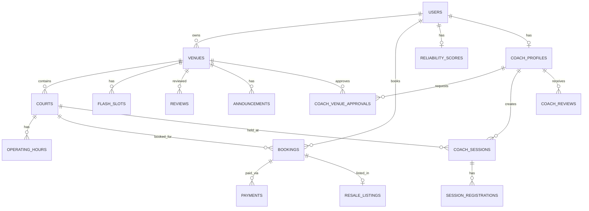

# CourtPass — Entity Relationship Diagram (ERD)

## Schema Overview
- 17 Normalized Tables
- Hard DB constraints (UNIQUE constraint on `(court_id, slot_date, slot_start, status)` to prevent double-booking)
- Immutable Audit Log table for tracking every state transition
